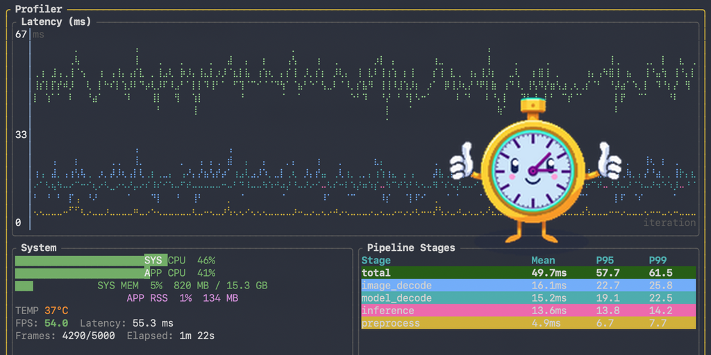
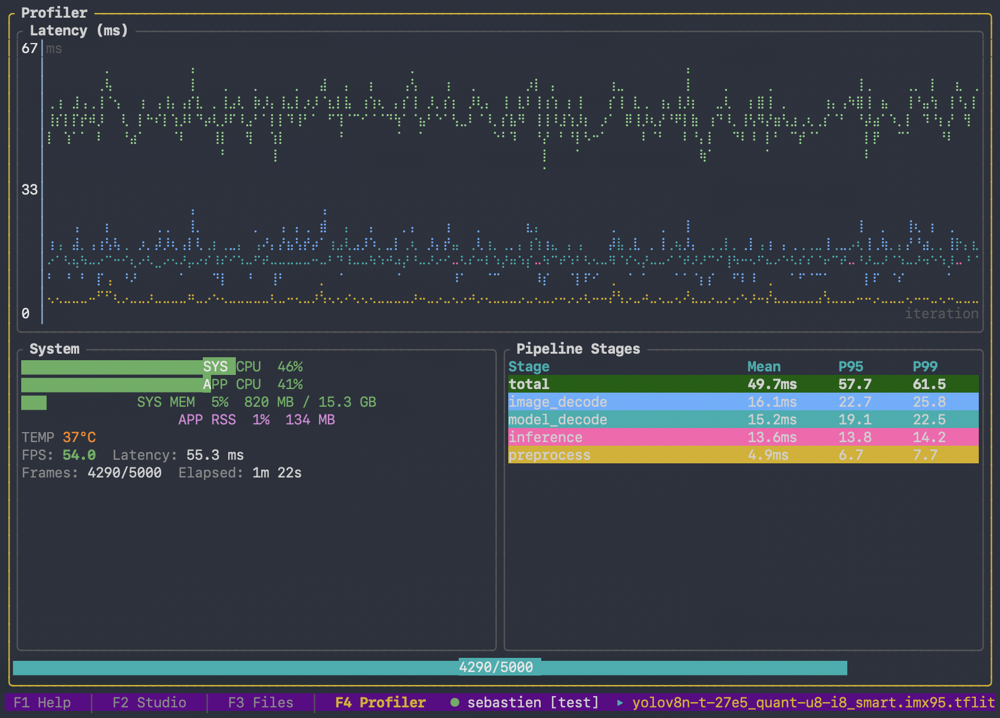
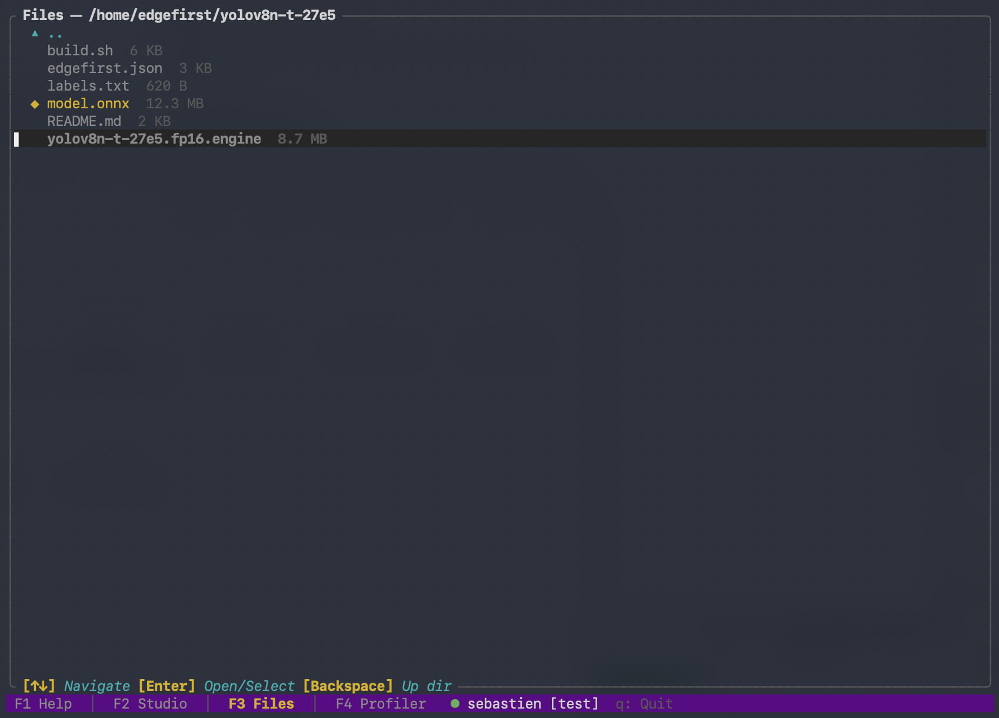

<p align="center">
  
</p>

<p align="center">
  <picture>
    <source media="(prefers-color-scheme: dark)" srcset="assets/edgefirst-wordmark-dark.png">
    
  </picture>
</p>

<h1 align="center">EdgeFirst Profiler CLI</h1>

<p align="center"><i>Command-line interface for the EdgeFirst Profiler — on-target performance measurement for AI vision pipelines.</i></p>

<p align="center">
  <a href="https://github.com/EdgeFirstAI/profiler-cli/releases/latest"></a>
  
  <a href="LICENSE"></a>
  <a href="https://edgefirst.studio"></a>
</p>

---

## Why edgefirst-profiler

The EdgeFirst Profiler is a feature of [EdgeFirst Studio](https://edgefirst.studio) that measures how AI vision pipelines actually perform on the hardware they will run on — not on your laptop, not in a simulator, not against an emulated tensor.

- **Per-operator timing on the real device.** Find the actual bottleneck inside your model — the specific Conv layer, the NPU op, the post-processing pass — rather than guessing from a single end-to-end number.
- **Results and traces publish to EdgeFirst Studio.** Compare runs across models, devices, and configurations side-by-side. Track regressions over time. Share findings with your team without copying files around.
- **Validation against your dataset.** Combine a model with a Studio validation session to get mAP / mIoU alongside latency in one command.

<p align="center"></p>

## Install

**Linux and macOS**

```sh
curl -fsSL https://raw.githubusercontent.com/EdgeFirstAI/profiler-cli/main/install.sh | bash
```

**Windows (PowerShell)**

```powershell
irm https://raw.githubusercontent.com/EdgeFirstAI/profiler-cli/main/install.ps1 | iex
```

**Pin a specific version**

```sh
curl -fsSL https://raw.githubusercontent.com/EdgeFirstAI/profiler-cli/main/install.sh | bash -s -- --version 0.2.0
```

```powershell
& ([scriptblock]::Create((irm https://raw.githubusercontent.com/EdgeFirstAI/profiler-cli/main/install.ps1))) -Version 0.2.0
```

The installer detects your OS and architecture, fetches the matching release artifact, verifies its SHA-256, and installs to `/usr/local/bin` (when run as root) or `~/.local/bin` (otherwise). On Windows it installs to `%ProgramFiles%\edgefirst-profiler\` (elevated) or `%LOCALAPPDATA%\Programs\edgefirst-profiler\` (per-user) and updates your `PATH`. Use `--prefix DIR` (or `-Prefix DIR`) to override.

**Verify**

```sh
edgefirst-profiler --version
```

## Run with Docker

Pre-built images are published to `ghcr.io/edgefirstai/profiler-cli` — no Rust
toolchain or local install required. Each runtime is built for the architectures it
supports; the set spans both x86_64 and aarch64, but not every tag is multi-arch.

```sh
docker pull ghcr.io/edgefirstai/profiler-cli:onnx
```

### Tags and architectures

| Tag | Runtime | x86_64 | aarch64 | Status |
|-----|---------|:------:|:-------:|--------|
| `onnx`, `latest` | CPU ONNX Runtime | ✅ | ✅ | available |
| `core` | Binary only — bring your own runtime (`FROM` base) | ✅ | ✅ | available |
| `cuda` | NVIDIA GPU (CUDA 12.6 / cuDNN 9) | ✅ | — | available (Jetson/Orin aarch64 in progress) |
| `tflite` | TFLite + NXP Neutron NPU (i.MX 95) | — | ✅ | planned |
| `ara240` | Kinara Ara-2 DVM | ✅ | ✅ | planned |
| `hailo` | Hailo-8 / Hailo-8L (HailoRT) | ✅ | ✅ | planned |

`onnx`/`latest` and `core` are multi-arch (x86_64 + aarch64). `cuda` is currently
**amd64-only** (Jetson/Orin aarch64 support is in progress). Immutable per-release
tags follow `VERSION-VARIANT` (e.g. `1.6.0-onnx`); see the [CHANGELOG](CHANGELOG.md).

> **`onnx` / `latest` is CPU-only.** Throughput measured on these tags runs on the
> CPU ONNX Runtime regardless of any GPU in the host — GPU measurement requires `cuda`.

### EdgeFirst Studio workflow

The common case pulls the model and validation session from Studio, so **nothing from
the host needs to be mounted**. A named volume persists your auth token and the decode
cache across runs:

```sh
# log in once (interactive); the token is saved in the named volume
docker run -it --rm -e TERM=xterm-256color \
  -v edgefirst-profiler:/home/edgefirst \
  ghcr.io/edgefirstai/profiler-cli:onnx login

# profile a Studio session and publish results
docker run --rm \
  -v edgefirst-profiler:/home/edgefirst \
  ghcr.io/edgefirstai/profiler-cli:onnx \
  validate --session-id v-abc123 --publish
```

(Omit the `-v` volume entirely to run fully stateless — the cache is just discarded.)

### Profiling local model files (Linux / macOS)

To profile a model from disk, bind-mount a working directory as `/workdir`:

```sh
docker run --rm \
  -v edgefirst-profiler:/home/edgefirst -v "$PWD":/workdir \
  ghcr.io/edgefirstai/profiler-cli:onnx \
  validate --model /workdir/model.onnx --images /workdir/val
```

Files the profiler writes back into a bind-mounted `/workdir` are owned by root by
default. **Optional:** to have them owned by your host user on Linux/macOS, add
`--user "$(id -u):$(id -g)"`. This only matters when you bind-mount a host directory —
the Studio workflow above doesn't need it. (On Windows, omit `--user`; `$(id -u)` and
`$PWD` are POSIX-shell syntax — use the PowerShell equivalents, e.g. `${PWD}`.)

### NVIDIA GPU — amd64 (Linux)

Requires `nvidia-container-toolkit` on the host:

```sh
docker run --rm --gpus all \
  -v edgefirst-profiler:/home/edgefirst -v "$PWD":/workdir \
  ghcr.io/edgefirstai/profiler-cli:cuda \
  validate --model /workdir/model.onnx --provider cuda --images /workdir/val
```

## Examples

**Profile a YOLOv8 model offline (ONNX)**

```sh
edgefirst-profiler validate --model yolov8n.onnx --images ./val
```

**Profile a TFLite model with the NPU on i.MX 95**

```sh
edgefirst-profiler validate --model yolov8n.tflite --delegate libneutron_delegate.so
```

**Validate against an EdgeFirst Studio session and publish results**

```sh
edgefirst-profiler login
edgefirst-profiler validate --session-id v-abc123 --publish
```

<p align="center"></p>


## Built on the EdgeFirst Perception Foundation

The EdgeFirst Profiler is built on the [EdgeFirst Perception Foundation](https://github.com/EdgeFirstAI/.github/blob/main/profile/foundation.md), the same zero-copy, platform-aware infrastructure that runs production EdgeFirst perception pipelines. It uses `edgefirst-hal` for hardware-accelerated decode and pre/post-processing, `edgefirst-tflite` and `edgefirst-ara2` for NPU-aware inference, and `edgefirst-client` for Studio integration.

## Supported hardware

| Vendor / family | Notes |
|---|---|
| NVIDIA Jetson Orin / Orin Nano | aarch64; CUDA execution provider via ONNX Runtime |
| NXP i.MX 95 | aarch64; Neutron NPU via the TFLite delegate |
| Hailo-8 / Hailo-8L | HailoRT runtime via HEF models; host-agnostic (Raspberry Pi, x86_64, or any Linux machine) |
| Kinara Ara-2 | DVM models via the `ara2-proxy` daemon |
| Generic Linux x86_64 / macOS / Windows | CPU profiling and Studio workflow |

## Documentation, support, status

- **Reference documentation:** [edgefirst.studio](https://edgefirst.studio) (the EdgeFirst Profiler section, when published).
- **Issues:** use the [GitHub issue tracker](https://github.com/EdgeFirstAI/profiler-cli/issues) — bug-report and feature-request templates are provided.
- **Support, sales, anything else:** `support@au-zone.com`.

---

<p align="center">
  <sub>Copyright © 2026 Au-Zone Technologies Inc. — Part of <a href="https://edgefirst.studio">EdgeFirst Studio</a>.</sub>
</p>
